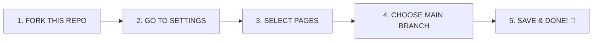

  
  <!-- Main Preview Image - BIG and BOLD -->
  
  
  <br />
  <br />
  
  <!-- Tech Stack -->
  
  
  
  
  <br />
  
  
  
</div>

---

## 🚀 **ONE PAGE. INFINITE MOVIES.**

This is a **single HTML file** movie site - clean, fast, and works everywhere!

---

## 📸 **LIVE PREVIEW**

<div align="center">
  
  
  <br />
  <br />
  
  <sub>✨ This is your site preview - replace with your actual screenshot ✨</sub>
</div>

---

## 🚀 **DEPLOY IN 3 SIMPLE STEPS**

<div align="center">
  
### 📦 **FORK & DEPLOY TO GITHUB PAGES**

</div>



STEP-BY-STEP INSTRUCTIONS

<div align="center">
  <table>
    <tr>
      <td align="center" width="300">
        <h3>🔹 STEP 1</h3>
        
        <br />
        <b>Fork this repository</b>
        <br />
        Click the Fork button at the top right
      </td>
      <td align="center" width="300">
        <h3>🔹 STEP 2</h3>
        
        <br />
        <b>Go to Settings</b>
        <br />
        Navigate to repository Settings tab
      </td>
      <td align="center" width="300">
        <h3>🔹 STEP 3</h3>
        
        <br />
        <b>Click on Pages</b>
        <br />
        Find Pages in the left sidebar
      </td>
    </tr>
    <tr>
      <td align="center">
        <h3>🔹 STEP 4</h3>
        
        <br />
        <b>Select 'main' branch</b>
        <br />
        Choose branch and /root folder
      </td>
      <td align="center">
        <h3>🔹 STEP 5</h3>
        
        <br />
        <b>Click Save</b>
        <br />
        Wait 2 minutes for deployment
      </td>
      <td align="center" bgcolor="#f0f0f0">
        <h3>🎉 DONE!</h3>
        
        <br />
        <b>Your site is LIVE at:</b>
        <br />
        <code>https://YOURUSERNAME.github.io/movie/</code>
      </td>
    </tr>
  </table>
</div>

---

🌐 YOUR LIVE SITE

<div align="center">
  <table>
    <tr>
      <td align="center" bgcolor="#1a1a1a" style="padding: 30px; border-radius: 15px;">
        <h2>🔴 YOUR SITE IS HERE</h2>
        <a href="https://emmyhenz.github.io/movie/">
          
        </a>
        <br />
        <code style="font-size: 18px;">https://emmyhenz.github.io/movie/</code>
      </td>
    </tr>
  </table>
</div>

---

📁 IT'S JUST ONE FILE!

<div align="center">

```
📁 YOUR REPOSITORY
│
├── 📄 index.html     ← THE ONLY FILE YOU NEED (98% of the site)
├── 🎨 style.css      ← Optional (can be inside HTML)
├── ⚙️ script.js      ← Optional (can be inside HTML)
└── 📄 README.md      ← This file
```

</div>

💡 PRO TIP: Everything can be inside a SINGLE HTML file! Open index.html and you'll see the entire site.

---

✨ FEATURES

<div align="center">

 Feature Description
🚀 Lightning Fast Single HTML file loads instantly
📱 100% Responsive Works on phone, tablet, desktop
🎨 Clean Design Modern, attractive interface
🔧 No Dependencies Pure HTML/CSS/JS - no frameworks
🌍 Works Anywhere GitHub Pages, Vercel, Netlify, any host
♾️ Forever Free Host on GitHub Pages for free

</div>

---

🔧 CUSTOMIZE YOUR SITE

Want to make it your own? Just edit index.html:

```html
<!-- Change the title -->
<title>YOUR MOVIE SITE NAME</title>

<!-- Update colors in style section -->
<style>
  :root {
    --primary-color: #YOUR_COLOR;  /* Change this */
    --secondary-color: #YOUR_COLOR; /* Change this */
  }
</style>

<!-- Add your own movies -->
<div class="movie-card">
  <h3>YOUR MOVIE TITLE</h3>
  <!-- Add your content -->
</div>
```

---

🎯 PROJECT STRUCTURE (SIMPLE)

<div align="center">

```
index.html
│
├── HEAD          → Title, styles, meta tags
├── BODY          → All visible content
│   ├── HEADER    → Site title & navigation
│   ├── MAIN      → Movie cards & content
│   └── FOOTER    → Copyright & links
└── SCRIPTS       → Interactive features
```

</div>

---

🤝 HOW TO CONTRIBUTE

<div align="center">
  
</div>

1. FORK this repository (top right button)
2. CLONE your fork: git clone https://github.com/YOUR-USERNAME/movie
3. EDIT the index.html file
4. COMMIT your changes: git add . then git commit -m "Your changes"
5. PUSH to GitHub: git push
6. CREATE a Pull Request

---

📊 REPO STATS

<div align="center">
  

  <br />

  
</div>

---

⚠️ FIX FOR TYPING SVG

If the typing animation at the top isn't working, replace it with this static version:

```html
<h1>
  <span style="color: #FF4500;">🎬 MOVIE SITE</span><br />
  <span style="font-size: 24px; color: #666;">Your Personal Movie Hub</span>
</h1>
```

Or use this working CDN link:

```html

```

---

💖 SUPPORT

<div align="center">
  <a href="https://github.com/emmyhenz/movie/stargazers">
    
  </a>

  <br />
  <br />

  <table>
    <tr>
      <td>
        <a href="https://github.com/emmyhenz">
          
        </a>
      </td>
      <td>
        <a href="https://twitter.com/emmyhenz">
          
        </a>
      </td>
    </tr>
  </table>
</div>

---

<div align="center">
  <h3>
    <span style="color: #FF4500;">❤️</span> 
    Made with pure HTML, CSS & JavaScript 
    <span style="color: #FF4500;">❤️</span>
  </h3>

  <br />

  

  <br />
  <br />

<sub>© 2024 Emmyhenz | Movie Site - One file, infinite possibilities</sub>
<br />
<sub>🍿 Click the STAR button above if you like it! ⭐</sub>

</div>
